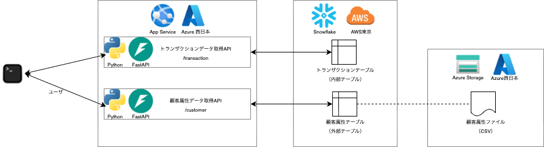

# 東日本リージョン逼迫？
App Serviceが立ち上がらない。CPUクォータ不足と出るが、不足しておらず。。西日本で代替、SnowflakeはAWS東京しか持ってない。
## 1. 構成図

APIを2本試作、データは別件作成のテストデータをそのまま利用。<br>
1本目は、ユーザIDを指定して、当該ユーザの購買トランザクションデータを取得する（簡単のため先頭行だけ応答）。これは普通にSnowflakeの内部テーブルにクエリする。<br>
2本目は、ユーザIDを指定して、当該ユーザの属性情報を取得する。こちらは、オブジェクトストレージ上のファイルデータから一意キー指定でデータを取得する方式の試行。<br>
何かしらのクエリエンジンが必要となるが、Snowflakeの外部テーブルをクエリエンジンと仮定し、実装。<br>
道中、AWS東京リージョンのSnowflakeに対して、西日本のazureストレージをストレージ統合するという手順を踏むことができ、非常に満足。<br>
テーブル内に承認URLできたり、サービスアカウント作成後にSnowflakeの企業トップページにリダイレクトされたりして、新感覚。

## 2. APIの実装
Python、Fast APIにてCoplilotで実装。Github proでもSnowflakeカーソルへの引数の渡し方がわからなかったみたい。何回も失敗。<br>
1枚ものなのはこちらからの指示によるもの。
```
from fastapi import FastAPI, HTTPException
from pydantic import BaseModel
from typing import List
import snowflake.connector
import datetime 

app = FastAPI()

# Snowflake接続情報（適宜変更してください）
SNOWFLAKE_CONFIG = {
    "user": "MY_PYTHON_USER",
    "account": "**********",
    "warehouse": "COMPUTE_WH",
    "database": "TESTDB",
    "schema": "PUBLIC",
    "private_key_file": "rsa_key.p8"
}

# Snowflake接続を取得する関数
def get_snowflake_connection():
    return snowflake.connector.connect(**SNOWFLAKE_CONFIG)

# トランザクションデータレスポンス用のPydanticモデル
class TransactionData(BaseModel):
    USERID: str
    DATE: str
    CATEGORY: str
    UNIT: float
    QUANTITY: int
    AMOUNT: float
    PAYMENT: str
    LOCATION: str

# 顧客データレスポンス用のPydanticモデル
class CustomerData(BaseModel):
    USERID: str
    AGE: str
    GENDER: str
    AREA: str
    JOB: str
    INCOME: str
    EDUCATION: str
    FAMILY: str
    INTEREST: str
    DEVICE: str

@app.get("/transaction", response_model=List[TransactionData])
async def get_transaction_data(user_id: str):
    connection = get_snowflake_connection()
    cursor = connection.cursor()
    
    try:
        query = "SELECT TOP 1 * FROM TESTDB.PUBLIC.TRANSACTION_DATA WHERE USERID = %(user_id)s"
        print(user_id)
        cursor.execute(query, {"user_id": user_id})
        results = cursor.fetchall()

        # カラム名を取得してJSON形式に変換
        columns = [desc[0] for desc in cursor.description]
        data = []
        for row in results:
            row_dict = dict(zip(columns, row))
            # DATEカラムを文字列に変換
            if "DATE" in row_dict and isinstance(row_dict["DATE"], (datetime.date, datetime.datetime)):
                row_dict["DATE"] = row_dict["DATE"].isoformat()
            data.append(row_dict)


        if not data:
            raise HTTPException(status_code=404, detail="No data found for the given user_id")

        return data
    except Exception as e:
        raise HTTPException(status_code=500, detail=str(e))
    finally:
        cursor.close()
        connection.close()

@app.get("/customer", response_model=List[CustomerData])
async def get_customer_data(user_id: str):
    connection = get_snowflake_connection()
    cursor = connection.cursor()
    
    try:
        query = "SELECT USERID, AGE, GENDER, AREA, JOB, INCOME, EDUCATION, FAMILY, INTEREST, DEVICE FROM TESTDB.PUBLIC.MY_AZURE_DATA WHERE USERID = %(user_id)s"
        print(user_id)
        cursor.execute(query, {"user_id": user_id})
        results = cursor.fetchall()

        # カラム名を取得してJSON形式に変換
        columns = [desc[0] for desc in cursor.description]
        data = []
        for row in results:
            row_dict = dict(zip(columns, row))
            data.append(row_dict)

        if not data:
            raise HTTPException(status_code=404, detail="No data found for the given user_id")

        return data
    except Exception as e:
        raise HTTPException(status_code=500, detail=str(e))
    finally:
        cursor.close()
        connection.close()

```

## 3. Snowflakeの設定（外部ストレージ統合、ユーザ、ロール、外部テーブル定義など）
外部ストレージ統合は普通な感じ。
```
CREATE STORAGE INTEGRATION azure_dl_stage_int
  TYPE = EXTERNAL_STAGE
  STORAGE_PROVIDER = AZURE
  ENABLED = TRUE
  AZURE_TENANT_ID = '***'
  STORAGE_ALLOWED_LOCATIONS = (
    'azure://mydatalake202508301226.blob.core.windows.net/mycont/'
  );
```
実行後に、azure_dl_stage_intをDESCして、AZURE_CONSENT_URLに記載のURLで承認すると、AZURE_MULTI_TENANT_APP_NAMEに格納されている文字列の_前の文字列を名称とするサービスアカウントがAzure側にできる感じでした。<br>
外部ステージを作成。
```
CREATE STAGE my_azure_stage
  STORAGE_INTEGRATION = azure_dl_stage_int
  URL = 'azure://mydatalake202508301226.blob.core.windows.net/mycont/'
  FILE_FORMAT = (TYPE = CSV FIELD_OPTIONALLY_ENCLOSED_BY='"' SKIP_HEADER=1);
```
外部テーブルを作成
```
CREATE OR REPLACE EXTERNAL TABLE my_azure_data (
    USERID STRING AS (VALUE:c1::STRING),
    AGE STRING AS (VALUE:c2::STRING),
	GENDER STRING AS (VALUE:c3::STRING),
	AREA STRING AS (VALUE:c4::STRING),
	JOB STRING AS (VALUE:c5::STRING),
	INCOME STRING AS (VALUE:c6::STRING),
	EDUCATION STRING AS (VALUE:c7::STRING),
	FAMILY STRING AS (VALUE:c8::STRING),
	INTEREST STRING AS (VALUE:c9::STRING),
	DEVICE STRING AS (VALUE:c10::STRING)
)
WITH LOCATION = @my_azure_stage
FILE_FORMAT = (TYPE = CSV FIELD_OPTIONALLY_ENCLOSED_BY='"' SKIP_HEADER=1)
AUTO_REFRESH = FALSE;
```
AS以降が見慣れない書き方ですが、c1, c2, ...というのが左から数えたカラムの番号（Snowflake内部で作成される変数）で、その後ろが外部ステージ側での変数型、なようです。<br>
APIユーザは、新仕様に基づきSERVICEユーザとして作成。ローカルで秘密鍵と公開鍵のペアを作成、公開鍵は一行化して出力してSQLに貼り付けて登録、秘密鍵はpythonと同じ階層に配置して使っています。実務上はKeyVault管理になるかなと思います。<br>
ロールも上記ユーザ用のものを作成し、内部テーブル、外部テーブルの両者に対して、データベースとスキーマのUSAGE権限、テーブルのSELECT権限を付与しました。

## 4. WebAppsへのデプロイ、実行結果
Github紐付けてGithub ActionsやAzure Pipelineを経由してCICDするのが通常なようです。今回はZip化してCLIで送信しました。<br>
実行結果はシュールですが記載だけしておきます。
```
~ % curl 'https://mydemoapp202508301428-btdngqesbvbedwfg.japanwest-01.azurewebsites.net/customer?user_id=41467f4d-fdf9-4aaf-b517-8918cff09436'
[{"USERID":"41467f4d-fdf9-4aaf-b517-8918cff09436","AGE":"65+","GENDER":"その他","AREA":"東京都","JOB":"エンジニア","INCOME":"500-700万円","EDUCATION":"専門学校卒","FAMILY":"既婚","INTEREST":"ガーデニング","DEVICE":"PC中心"}]
         
~ % curl 'https://mydemoapp202508301428-btdngqesbvbedwfg.japanwest-01.azurewebsites.net/transaction?user_id=41467f4d-fdf9-4aaf-b517-8918cff09436'
[{"USERID":"41467f4d-fdf9-4aaf-b517-8918cff09436","DATE":"2024-04-01","CATEGORY":"Food & Drink","UNIT":485.48,"QUANTITY":1,"AMOUNT":485.48,"PAYMENT":"Other","LOCATION":"群馬県"}]
```

## 5. APIをPython/FastAPIからC#/ASP .NET Coreに変更してみた
Macへのインストール手順は適当に探りつつ、主要なコードのみ掲載。<br>
まずは大元の実行ファイル。
```
[Program.cs]
using Microsoft.AspNetCore.Builder;
using Microsoft.Extensions.DependencyInjection;
using Microsoft.Extensions.Hosting;

namespace TodoApi
{
	public class Program
	{
		public static void Main(string[] args)
		{
			var builder = WebApplication.CreateBuilder(args);
			builder.Services.AddControllers();
			builder.Services.AddEndpointsApiExplorer();
			builder.Services.AddSwaggerGen();

			var app = builder.Build();

			if (app.Environment.IsDevelopment())
			{
				app.UseSwagger();
				app.UseSwaggerUI();
			}

			app.UseHttpsRedirection();
			app.UseAuthorization();
			app.MapControllers();

			app.Run();
		}
	}
}
```
入力値バリデータ
```
[Models/UserIdRequest.cs]
using System.ComponentModel.DataAnnotations;

namespace TodoApi.Models
{
    public class UserIdRequest
    {
        [Required]
        [StringLength(50, MinimumLength = 1)]
        public string UserId { get; set; }
    }
}
```
DTO
```
[Models/TransactionData.cs]
using System;

namespace TodoApi.Models
{
    public class TransactionData
    {
        public decimal AMOUNT { get; set; }
        public string CATEGORY { get; set; }
        public DateTime DATE { get; set; }
        public string LOCATION { get; set; }
        public string PAYMENT { get; set; }
        public int QUANTITY { get; set; }
        public decimal UNIT { get; set; }
        public string USERID { get; set; }
    }
}
```
コントローラ
```
[Controllers/TransactionDataController.cs]
using Microsoft.AspNetCore.Mvc;
using System.Collections.Generic;
using TodoApi.Models;
using TodoApi.Data;

namespace TodoApi.Controllers
{
    [ApiController]
    [Route("api/[controller]")]
    public class TransactionDataController : ControllerBase
    {
        private readonly IConfiguration _configuration;

        public TransactionDataController(IConfiguration configuration)
        {
            _configuration = configuration;
        }

        [HttpGet]
        public ActionResult<IEnumerable<TransactionData>> GetByUserId([FromQuery] UserIdRequest request)
        {
            if (!ModelState.IsValid)
                return BadRequest(ModelState);

            var connStr = _configuration.GetConnectionString("SnowflakeConnection");
            var dao = new TransactionDataDao(connStr);
            var result = dao.GetByUserId(request.UserId);
            return Ok(result);
        }
    }
}
```
DAO
```
[Data/TransactionDataDao.cs]
using Snowflake.Data.Client;
using System.Collections.Generic;
using TodoApi.Models;

namespace TodoApi.Data
{
    public class TransactionDataDao
    {
        private readonly string _connectionString;

        public TransactionDataDao(string connectionString)
        {
            _connectionString = connectionString;
        }

        public IEnumerable<TransactionData> GetByUserId(string userid)
        {
            var result = new List<TransactionData>();
            using (var conn = new SnowflakeDbConnection())
            {
                conn.ConnectionString = _connectionString;
                conn.Open();
                using (var cmd = conn.CreateCommand())
                {
                    cmd.CommandText = "SELECT AMOUNT, CATEGORY, DATE, LOCATION, PAYMENT, QUANTITY, UNIT, USERID FROM TESTDB.PUBLIC.TRANSACTION_DATA WHERE USERID = :USERID";
                    var param = cmd.CreateParameter();
                    param.ParameterName = "USERID";
                    param.Value = userid;
                    cmd.Parameters.Add(param);
                    using (var reader = cmd.ExecuteReader())
                    {
                        while (reader.Read())
                        {
                            result.Add(new TransactionData
                            {
                                AMOUNT = reader.GetDecimal(0),
                                CATEGORY = reader.GetString(1),
                                DATE = reader.GetDateTime(2),
                                LOCATION = reader.GetString(3),
                                PAYMENT = reader.GetString(4),
                                QUANTITY = reader.GetInt32(5),
                                UNIT = reader.GetDecimal(6),
                                USERID = reader.GetString(7)
                            });
                        }
                    }
                }
            }
            return result;
        }
    }
}
```
Snowflakeへの接続設定はこちらに記載<br>
authenticator=snowflake_jwtをつけないとパスワード要求されて接続できません。<br>
運用環境では秘密鍵はKeyVaultに保存するのではないでしょうか。
```
[appsettings.json]
{
  "Logging": {
    "LogLevel": {
      "Default": "Information",
      "Microsoft.AspNetCore": "Warning"
    }
  },
  "AllowedHosts": "*"
    ,
    "ConnectionStrings": {
      "SnowflakeConnection": "account=***;user=***;password=;private_key_file=***;db=TESTDB;schema=PUBLIC;warehouse=COMPUTE_WH;role=MY_APP_ROLE;authenticator=snowflake_jwt"
    }
  }
```